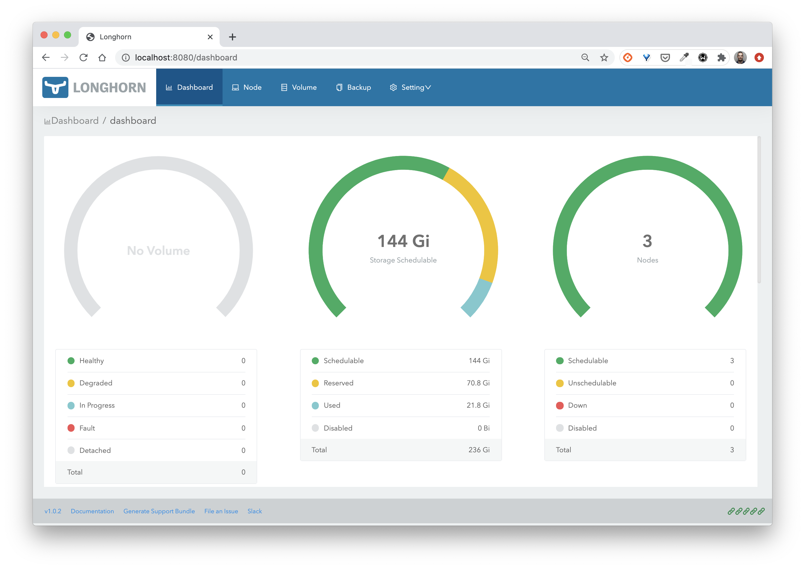
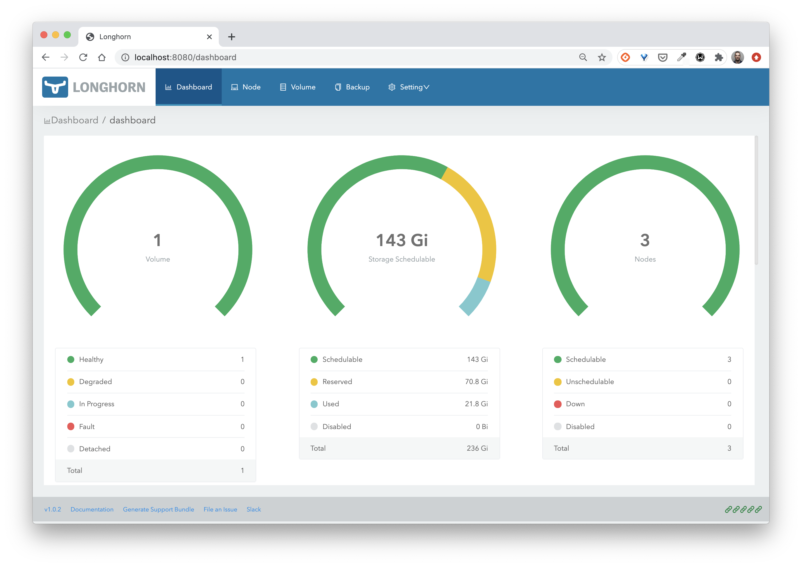
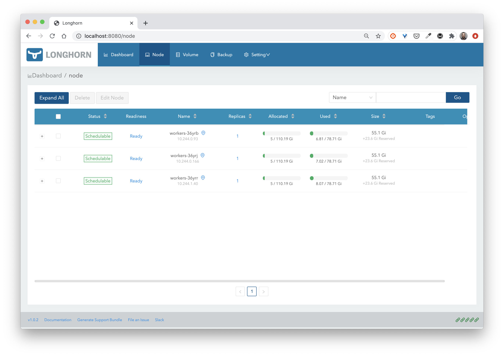

## Objectif

Dans cette mise en pratique, nous allons mettre en place *Longhorn*, une solution de stockage de type block provenant de Rancher. Longhorn est également un projet de la CNCF.


## Environnement

Pour cet exercice, nous utiliserons un cluster de 3 nodes.

## Déploiement de Longhorn

Utiliser la commande suivante pour déployer Longhorn sur votre cluster.

```
kubectl apply -f https://raw.githubusercontent.com/longhorn/longhorn/v1.4.2/deploy/longhorn.yaml
```

Différents composants seront alors créés:

```
namespace/longhorn-system created
Warning: policy/v1beta1 PodSecurityPolicy is deprecated in v1.21+, unavailable in v1.25+
podsecuritypolicy.policy/longhorn-psp created
serviceaccount/longhorn-service-account created
configmap/longhorn-default-setting created
configmap/longhorn-storageclass created
customresourcedefinition.apiextensions.k8s.io/backingimagedatasources.longhorn.io created
customresourcedefinition.apiextensions.k8s.io/backingimagemanagers.longhorn.io created
customresourcedefinition.apiextensions.k8s.io/backingimages.longhorn.io created
customresourcedefinition.apiextensions.k8s.io/backups.longhorn.io created
customresourcedefinition.apiextensions.k8s.io/backuptargets.longhorn.io created
customresourcedefinition.apiextensions.k8s.io/backupvolumes.longhorn.io created
customresourcedefinition.apiextensions.k8s.io/engineimages.longhorn.io created
customresourcedefinition.apiextensions.k8s.io/engines.longhorn.io created
customresourcedefinition.apiextensions.k8s.io/instancemanagers.longhorn.io created
customresourcedefinition.apiextensions.k8s.io/nodes.longhorn.io created
customresourcedefinition.apiextensions.k8s.io/orphans.longhorn.io created
customresourcedefinition.apiextensions.k8s.io/recurringjobs.longhorn.io created
customresourcedefinition.apiextensions.k8s.io/replicas.longhorn.io created
customresourcedefinition.apiextensions.k8s.io/settings.longhorn.io created
customresourcedefinition.apiextensions.k8s.io/sharemanagers.longhorn.io created
customresourcedefinition.apiextensions.k8s.io/snapshots.longhorn.io created
customresourcedefinition.apiextensions.k8s.io/volumes.longhorn.io created
clusterrole.rbac.authorization.k8s.io/longhorn-role created
clusterrolebinding.rbac.authorization.k8s.io/longhorn-bind created
role.rbac.authorization.k8s.io/longhorn-psp-role created
rolebinding.rbac.authorization.k8s.io/longhorn-psp-binding created
service/longhorn-backend created
service/longhorn-frontend created
service/longhorn-conversion-webhook created
service/longhorn-admission-webhook created
service/longhorn-engine-manager created
service/longhorn-replica-manager created
daemonset.apps/longhorn-manager created
deployment.apps/longhorn-driver-deployer created
deployment.apps/longhorn-ui created
deployment.apps/longhorn-conversion-webhook created
deployment.apps/longhorn-admission-webhook created
```

Après quelques dizaines de secondes vous pourrez vérifier que les Pods déployés par Longhorn tournent dans le namespace *longhorn-system*:

```
$ kubectl -n longhorn-system get po
NAME                                          READY   STATUS    RESTARTS       AGE
csi-attacher-dcb85d774-6rclb                  1/1     Running   0              3m52s
csi-attacher-dcb85d774-b52fq                  1/1     Running   0              3m52s
csi-attacher-dcb85d774-khbtd                  1/1     Running   0              3m52s
csi-provisioner-5d8dd96b57-2bdhk              1/1     Running   0              3m52s
csi-provisioner-5d8dd96b57-2gpgr              1/1     Running   0              3m52s
csi-provisioner-5d8dd96b57-7666k              1/1     Running   0              3m52s
csi-resizer-7c5bb5fd65-29lkj                  1/1     Running   0              3m51s
csi-resizer-7c5bb5fd65-kxfm6                  1/1     Running   0              3m51s
csi-resizer-7c5bb5fd65-tfwwm                  1/1     Running   0              3m51s
csi-snapshotter-5586bc7c79-h4jrn              1/1     Running   0              3m51s
csi-snapshotter-5586bc7c79-m45l8              1/1     Running   0              3m51s
csi-snapshotter-5586bc7c79-pp962              1/1     Running   0              3m51s
engine-image-ei-df38d2e5-dmm84                1/1     Running   0              4m1s
engine-image-ei-df38d2e5-f68dr                1/1     Running   0              4m1s
engine-image-ei-df38d2e5-wqzbf                1/1     Running   0              4m1s
instance-manager-e-267474d1                   1/1     Running   0              4m1s
instance-manager-e-91c24732                   1/1     Running   0              4m
instance-manager-e-d0749d62                   1/1     Running   0              3m59s
instance-manager-r-146fa6a5                   1/1     Running   0              3m59s
instance-manager-r-a5634c0a                   1/1     Running   0              4m
instance-manager-r-e727863e                   1/1     Running   0              4m1s
longhorn-admission-webhook-d956bb867-hqxwc    1/1     Running   0              4m47s
longhorn-admission-webhook-d956bb867-mbcc2    1/1     Running   0              4m47s
longhorn-conversion-webhook-9d6975c9c-52nfp   1/1     Running   0              4m49s
longhorn-conversion-webhook-9d6975c9c-pwztk   1/1     Running   0              4m48s
longhorn-csi-plugin-2428t                     2/2     Running   0              3m50s
longhorn-csi-plugin-q9zdc                     2/2     Running   0              3m50s
longhorn-csi-plugin-thr6z                     2/2     Running   0              3m50s
longhorn-driver-deployer-658c44c955-hdnb5     1/1     Running   0              4m49s
longhorn-manager-5z8ps                        1/1     Running   0              4m49s
longhorn-manager-9gx89                        1/1     Running   1 (4m2s ago)   4m49s
longhorn-manager-f8qs4                        1/1     Running   1 (4m2s ago)   4m49s
longhorn-ui-8685dc7d7b-4dntj                  1/1     Running   0              4m49s
```

Une *StorageClass* a également été mise en place:

```
$ kubectl get sc
NAME       PROVISIONER          RECLAIMPOLICY   VOLUMEBINDINGMODE   ALLOWVOLUMEEXPANSION   AGE
longhorn   driver.longhorn.io   Delete          Immediate           true                   4m56s
```

Note: si votre cluster ne contient pas déjà une StorageClass par défaut, vous pouvez utiliser la commande suivante afin d'utiliser celle créée par Longhorn:

```
kubectl patch storageclass longhorn -p '{"metadata": {"annotations":{"storageclass.kubernetes.io/is-default-class":"true"}}}'
```

## Accès à l'interface web

Utilisez la commande suivante pour exposer l'interface web de Longhorn via un *port-forward*:

```
kubectl port-forward -n longhorn-system service/longhorn-frontend 8080:80
```



Note: si vous accédez au cluster depuis un serveur intermédiaire (qui n'a pas d'interface autre que le terminal), vous pouvez soit:

- utiliser l'option *--address 0.0.0.0* dans la commande *port-forward* afin d'avoir accès au port 8080 depuis toutes les interfaces réseau de la machine (et donc également à partir de son ip externe)

- changer le type du service *longhorn-frontend* et le passer de *ClusterIP* à *NodePort*. Après avoir lancé la commande suivante vous pourrez accéder à l'interface de Longhorn via le port 30000 depuis l'un des nodes de votre cluster:
```
kubectl -n longhorn-system patch svc/longhorn-frontend -p '{"spec": {"type": "NodePort", "ports": [{"port": 80, "nodePort": 30000}]}}'
```

## Création d'un volume

La spécification suivante définit un *PersistentVolumeClaim* basé sur la *StorageClass* créée précédemment:

```
cat << EOF | kubectl apply -f -
apiVersion: v1
kind: PersistentVolumeClaim
metadata:
  name: mongo-pvc
spec:
  storageClassName: longhorn
  accessModes:
  - ReadWriteOnce
  resources:
    requests:
      storage: 5G
EOF
```

Vous pouvez ensuite voir qu'un PVC et un PV ont été créés:

```
$ kubectl get pvc,pv
NAME                             STATUS  VOLUME      CAPACITY  ACCESS MODES  STORAGECLASS   AGE
persistentvolumeclaim/mongo-pvc  Bound   pvc-b5b...  5Gi       RWO           longhorn       61s

NAME           CAPACITY  ACCESS MODES  RECLAIM POLICY  STATUS   CLAIM               STORAGECLASS   REASON   AGE
pv/pvc-b5b...  5Gi       RWO           Delete          Bound    default/mongo-pvc   longhorn                57s
```

Depuis l'interface web de Longhorn on peut alors voir qu'un volume a été crée.


Dans la suite, vous allez utiliser ce volume dans un Deployment.

## Utilisation dans un workload de base de données

Lancez le Deployment suivant, celui-ci utilise le PVC *mongo-pvc* créé précédemment.

```
cat << EOF | kubectl apply -f -
apiVersion: apps/v1
kind: Deployment
metadata:
  name: db
spec:
  selector:
    matchLabels:
      app: db
  template:
    metadata:
      labels:
        app: db
    spec:
      containers:
      - image: mongo:4.0
        name: mongo
        ports:
        - containerPort: 27017
        volumeMounts:
        - name: mongo-persistent-storage
          mountPath: /data/db
      volumes:
      - name: mongo-persistent-storage
        persistentVolumeClaim:
          claimName: mongo-pvc          
EOF
```

Depuis l'interface web de Longhorn vous pourrez alors voir que le volume est maintenant disponible et actif.



Depuis le menu *Node*, vous pourrez également voir que les 5G du volume sont répliqués sur les différentes nodes.



## Cleanup

Supprimez les ressources que vous avez créées:

```
kubectl delete deploy db
kubectl delete pvc mongo-pvc
```

La désinstallation de Longhorn se passe en 2 étapes:

- lancez le job de désinstallation et attendez qu'il se termine
```
kubectl create -f https://raw.githubusercontent.com/longhorn/longhorn/v1.4.2/uninstall/uninstall.yaml
kubectl get job/longhorn-uninstall -n default -w
```

- supprimez les autres composants
```
kubectl delete -f https://raw.githubusercontent.com/longhorn/longhorn/v1.4.2/deploy/longhorn.yaml
kubectl delete -f https://raw.githubusercontent.com/longhorn/longhorn/v1.4.2/uninstall/uninstall.yaml
```